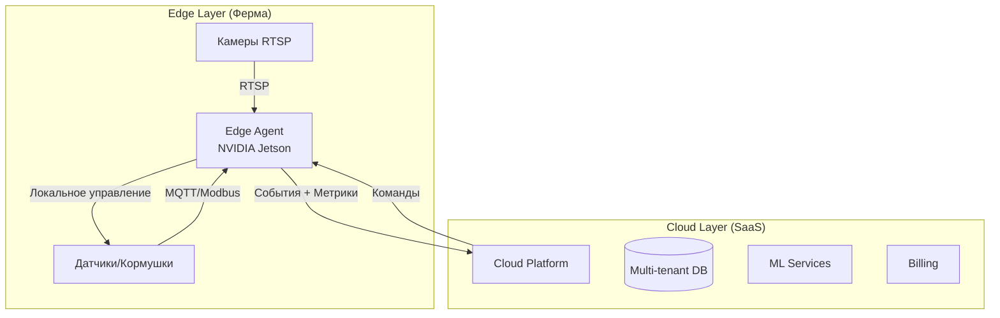
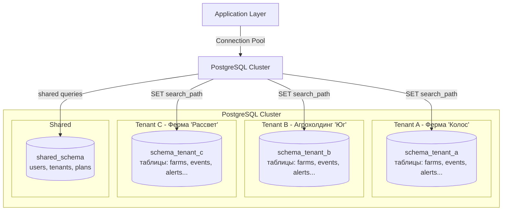
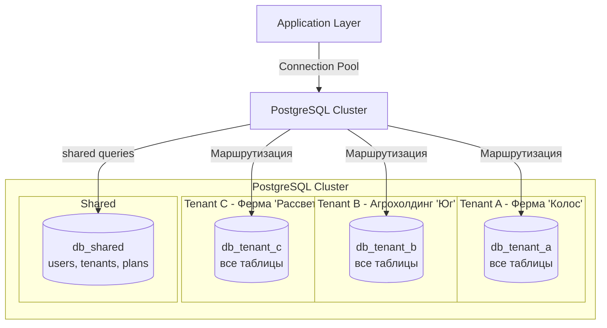
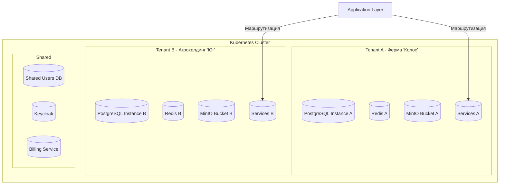
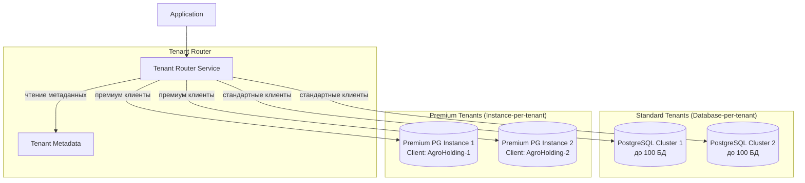
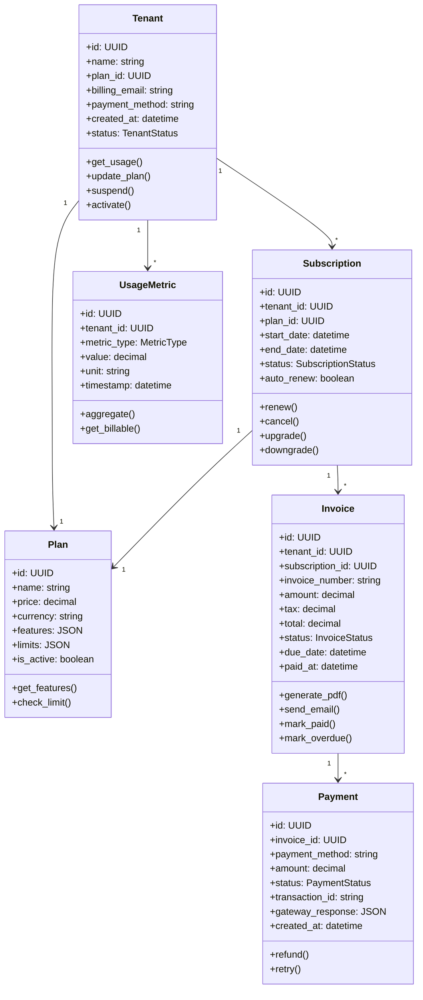
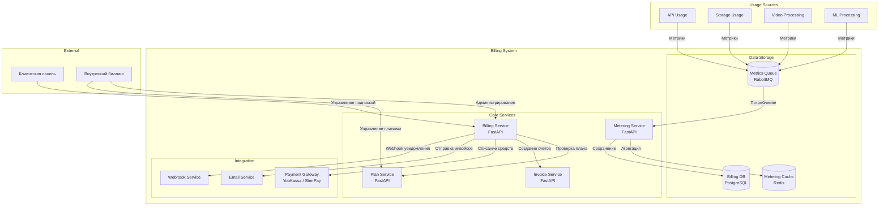
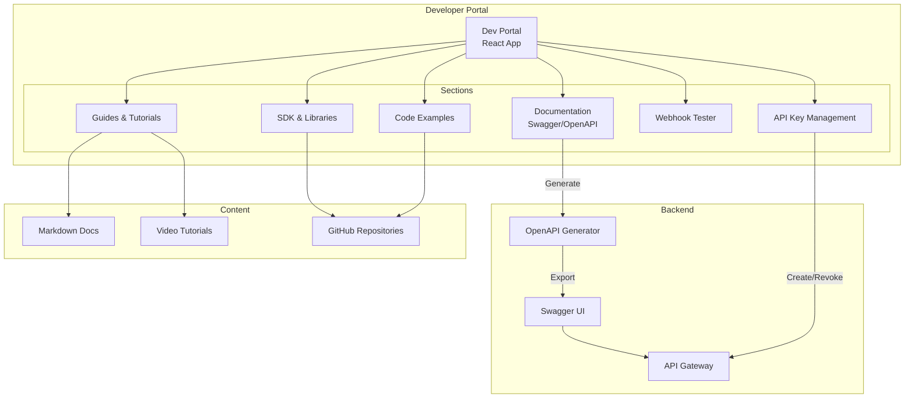
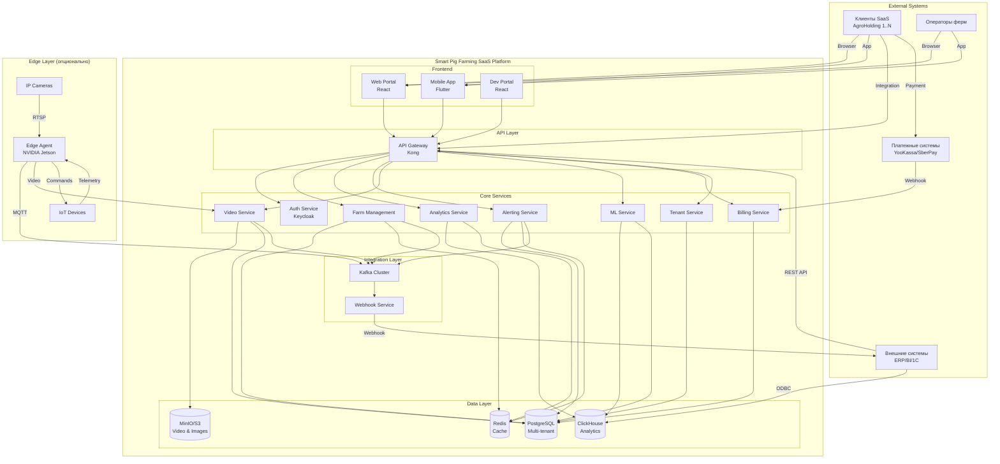
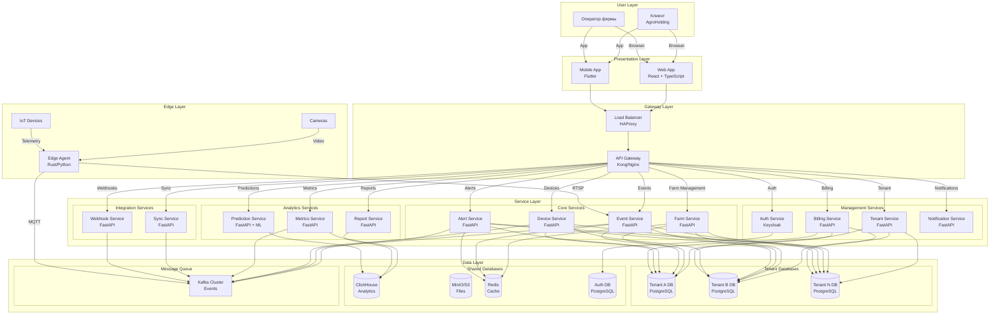

# ADR: Эволюция MVP в SaaS-платформу мониторинга скота (Smart Pig Farming SaaS)

---

## Метаданные

| Поле | Значение |
|------|----------|
| **Название** | Проектирование мультитенантной SaaS-платформы на основе MVP |
| **Автор** | Мельчинов Петр Викторович |
| **Дата** | 2026-07-22 |
| **Статус** | Утверждено |
| **Связанные ADR** | ADR: Архитектура платформы мониторинга скота (Smart Pig Farming) |
| **Версия** | 2.0 |

---

## Оглавление

1. [Контекст и постановка задачи](#1-контекст-и-постановка-задачи)
2. [Задача 1: Проектирование мультитенантной архитектуры](#2-задача-1-проектирование-мультитенантной-архитектуры)
3. [Задача 2: Разработка системы биллинга и монетизации](#3-задача-2-разработка-системы-биллинга-и-монетизации)
4. [Задача 3: Проработка интеграций с клиентами](#4-задача-3-проработка-интеграций-с-клиентами)
5. [Задача 4: Финальная архитектура To-Be](#5-задача-4-финальная-архитектура-to-be)
6. [План миграции и выводы](#6-план-миграции-и-выводы)

---

## 1. Контекст и постановка задачи

### 1.1. Бизнес-контекст

После успешного внедрения MVP на собственных фермах компании, принято решение о выводе решения на рынок как коммерческой SaaS-платформы. Целевая аудитория — агрохолдинги и крупные свиноводческие фермы России и стран СНГ.

**Ключевые бизнес-цели:**

1. **Создание регулярного дохода** через подписную модель
2. **Уменьшение TCO для клиентов** за счет облачной модели (CAPEX → OPEX)
3. **Масштабирование** на десятки и сотни клиентов
4. **Сбор данных** для создания собственных ML-моделей (data moat)
5. **Выход на рынок** в течение 3-4 месяцев после старта разработки

### 1.2. Архитектурные требования SaaS

| № | Требование | Описание |
|---|-----------|----------|
| ST-01 | **Мультитенантность** | Полная изоляция данных между клиентами (tenant isolation) |
| ST-02 | **Гибкая система подписок** | Разные тарифные планы с разным набором функций |
| ST-03 | **API для интеграции** | REST/GraphQL API для интеграции с системами клиентов |
| ST-04 | **Self-service портал** | Панель управления аккаунтом для клиентов |
| ST-05 | **Горизонтальное масштабирование** | Возможность роста числа клиентов без деградации |
| ST-06 | **Метрики использования** | Сбор данных для биллинга и аналитики |
| ST-07 | **Интеграция с платежными системами** | Поддержка российских платежных систем |
| ST-08 | **Онбординг** | Документация и API для самостоятельной интеграции |

### 1.3. Базовое решение из Задания 4

Для SaaS платформы используется **распределенная архитектура с полноценным Edge** как основа, выбранная в Задании 4 для этапа продакшена:

**Ключевые компоненты:**

* **Edge Layer (Ферма)**: Edge Agent (NVIDIA Jetson), Камеры RTSP, Датчики/Кормушки
* **Cloud Layer (SaaS)**: Cloud Platform, Multi-tenant DB, ML Services, Billing

**Принцип работы:**

* Камеры передают RTSP поток на Edge Agent
* Edge Agent анализирует видео локально (TensorRT)
* Датчики и кормушки управляются через Modbus/MQTT
* В облако отправляются только события и метрики
* Cloud платформа обеспечивает мультитенантность и биллинг

---

## 2. Задача 1: Проектирование мультитенантной архитектуры

### 2.1. Варианты изоляции данных

#### Вариант 1: Изоляция на уровне схем (Schema-per-tenant)

**Структура:**

* Один кластер PostgreSQL
* Отдельная схема для каждого tenant'а
* Общая схема для shared данных (пользователи, планы)

**Преимущества:**

* Экономичное использование ресурсов БД
* Простое управление (одна БД, много схем)
* Легкое бэкапирование (pg_dump по схеме)
* Быстрое переключение между tenant'ами

**Недостатки:**

* Риск утечки данных при ошибках в SQL (если забыть SET search_path)
* Ограничение на количество схем (практически неограничено, но есть)
* Сложность восстановления одной схемы из бэкапа
* Все tenant'ы в одном инстансе — shared ресурсы

---

#### Вариант 2: Изоляция на уровне БД (Database-per-tenant)

**Структура:**

* Один кластер PostgreSQL
* Отдельная база данных для каждого tenant'а
* Общая БД для shared данных

**Преимущества:**

* Максимальная изоляция данных
* Простое бэкапирование (отдельная БД)
* Простое восстановление (одна БД)
* Возможность размещения на разных серверах
* Легкая миграция данных между инстансами

**Недостатки:**

* Больше накладных расходов (каждая БД требует ресурсов)
* Сложнее управление подключениями
* Ограничение на количество БД в кластере
* Дороже для большого числа мелких tenant'ов

---

#### Вариант 3: Изоляция на уровне инстансов (Instance-per-tenant)

**Структура:**

* Отдельный PostgreSQL инстанс для каждого tenant'а
* Отдельный Redis для каждого tenant'а
* Отдельный MinIO bucket для каждого tenant'а
* Shared сервисы (Auth, Billing) общие

**Преимущества:**

* Полная изоляция ресурсов (включая CPU, память, сеть)
* Независимое масштабирование для крупных клиентов
* Изолированные обновления (канареечные)
* Максимальная безопасность
* Возможность выделенного SLA для крупных клиентов

**Недостатки:**

* Высокая стоимость (ресурсы на каждый инстанс)
* Сложность управления (много инстансов)
* Долгое время развертывания нового tenant'а
* Избыточно для мелких клиентов

---

### 2.2. Сравнение вариантов

| Критерий | Schema-per-tenant | Database-per-tenant | Instance-per-tenant |
|----------|-------------------|---------------------|---------------------|
| **Стоимость** | Низкая | Средняя | Высокая |
| **Изоляция** | Средняя | Высокая | Максимальная |
| **Сложность управления** | Низкая | Средняя | Высокая |
| **Масштабируемость** | Средняя | Высокая | Максимальная |
| **Время онбординга** | Мгновенно | < 1 минуты | ~5-10 минут |
| **Бэкапирование** | Среднее | Простое | Простое |
| **Восстановление** | Сложное | Простое | Простое |
| **Подходит для** | SMB, стартапы | Enterprise, средний бизнес | Enterprise+, HIPAA |
| **Ограничение** | ~1000 схем | ~100 БД на кластер | ~50 инстансов на кластер |

---

### 2.3. Выбранный подход: Гибридная стратегия

**Решение:** Использовать **Database-per-tenant** как основной подход с возможностью **Instance-per-tenant** для крупных клиентов.

**Архитектура Tenant Router:**

* **Tenant Router Service** — определяет, где находится БД tenant'а
* **Tenant Metadata** — хранит информацию о tenant'ах и их БД
* **Standard Tenants** — Database-per-tenant (до 100 БД на кластер)
* **Premium Tenants** — Instance-per-tenant (выделенные инстансы)

**Обоснование выбора:**

1. **Database-per-tenant** для 90% клиентов:
   * Оптимальный баланс изоляции и стоимости
   * Простое управление через один кластер
   * Быстрый онбординг (< 1 минуты)

2. **Instance-per-tenant** для крупных клиентов (Enterprise+):
   * Требования к выделенным ресурсам
   * Специфические требования безопасности
   * Возможность кастомизации инфраструктуры

---

## 3. Задача 2: Разработка системы биллинга и монетизации

### 3.1. Тарифные планы

| Функция | Starter | Business | Enterprise | Premium |
|---------|---------|----------|------------|---------|
| **Количество ферм** | 1 | 5 | 20 | Неограничено |
| **Количество камер** | 4 | 20 | 100 | Неограничено |
| **Хранение данных** | 30 дней | 90 дней | 1 год | 5+ лет |
| **Видеоаналитика** | Базовая | Расширенная | Полная | Полная + кастомная |
| **Уведомления** | Email | Email + SMS | Push + SMS + Email | Все каналы |
| **API доступ** | Нет | Ограниченный | Полный | Полный + Webhook |
| **Поддержка** | 5/2 | 5/2 | 24/7 | 24/7 + Выделенный менеджер |
| **Edge-агент** | Нет | Нет | Да | Да |
| **Собственная ML модель** | Нет | Нет | Нет | Да |
| **Цена (мес)** | $99 | $499 | $1,999 | Индивидуально |

---

### 3.2. Архитектура биллинга

**Core Services:**

* **Billing Service (FastAPI)** — управление подписками, платежами
* **Plan Service (FastAPI)** — управление тарифными планами
* **Metering Service (FastAPI)** — сбор и агрегация метрик использования
* **Invoice Service (FastAPI)** — генерация счетов и инвойсов

**Data Storage:**

* **Billing DB (PostgreSQL)** — хранение данных биллинга
* **Metering Cache (Redis)** — кэш для метрик
* **Metrics Queue (RabbitMQ)** — очередь для метрик использования

**Integration:**

* **Payment Gateway** — YooKassa, SberPay, Tinkoff Pay, ПСБ Pay
* **Email Service** — отправка инвойсов и уведомлений
* **Webhook Service** — уведомления о платежах

**Usage Sources:**

* API Usage — количество запросов к API
* Storage Usage — объем хранимых данных
* Video Processing — количество обработанных видео
* ML Processing — количество ML-вычислений

---

### 3.3. Модель данных биллинга

**Tenant (Арендатор):**

* id: UUID — уникальный идентификатор
* name: string — название компании
* plan_id: UUID — идентификатор тарифного плана
* billing_email: string — email для биллинга
* payment_method: string — метод оплаты
* created_at: datetime — дата создания
* status: TenantStatus — статус (активен/заморожен/заблокирован)

**Методы:** get_usage(), update_plan(), suspend(), activate()

**Plan (Тарифный план):**

* id: UUID — уникальный идентификатор
* name: string — название плана
* price: decimal — цена
* currency: string — валюта
* features: JSON — список функций
* limits: JSON — лимиты по функциям
* is_active: boolean — активен ли план

**Методы:** get_features(), check_limit()

**Subscription (Подписка):**

* id: UUID — уникальный идентификатор
* tenant_id: UUID — идентификатор арендатора
* plan_id: UUID — идентификатор плана
* start_date: datetime — дата начала
* end_date: datetime — дата окончания
* status: SubscriptionStatus — статус подписки
* auto_renew: boolean — автопродление

**Методы:** renew(), cancel(), upgrade(), downgrade()

**UsageMetric (Метрика использования):**

* id: UUID — уникальный идентификатор
* tenant_id: UUID — идентификатор арендатора
* metric_type: MetricType — тип метрики
* value: decimal — значение
* unit: string — единица измерения
* timestamp: datetime — временная метка

**Методы:** aggregate(), get_billable()

**Invoice (Счет):**

* id: UUID — уникальный идентификатор
* tenant_id: UUID — идентификатор арендатора
* subscription_id: UUID — идентификатор подписки
* invoice_number: string — номер счета
* amount: decimal — сумма
* tax: decimal — налог
* total: decimal — итого
* status: InvoiceStatus — статус счета
* due_date: datetime — дата оплаты
* paid_at: datetime — дата оплаты

**Методы:** generate_pdf(), send_email(), mark_paid(), mark_overdue()

**Payment (Платеж):**

* id: UUID — уникальный идентификатор
* invoice_id: UUID — идентификатор счета
* payment_method: string — метод оплаты
* amount: decimal — сумма
* status: PaymentStatus — статус платежа
* transaction_id: string — ID транзакции
* gateway_response: JSON — ответ от платежной системы
* created_at: datetime — дата создания

**Методы:** refund(), retry()




### 3.4. Интеграция с российскими платежными системами

**Поддерживаемые платежные системы:**

1. **YooKassa API v3** — универсальный платежный шлюз
2. **SberPay API** — оплата через Сбербанк
3. **Tinkoff Pay API** — оплата через Тинькофф
4. **ПСБ Pay API** — оплата через Промсвязьбанк

**Процесс интеграции:**

1. **Создание платежа** — клиент инициирует платеж через UI
2. **Выбор метода** — Payment Router выбирает подходящий шлюз
3. **Направление запроса** — запрос отправляется в выбранный шлюз
4. **Обработка платежа** — платежная система обрабатывает транзакцию
5. **Webhook уведомление** — платежная система уведомляет о статусе
6. **Валидация** — Payment Validator проверяет подпись и данные
7. **Подтверждение** — Billing Service обновляет статус подписки
8. **Уведомление клиента** — отправка email с подтверждением


---
### 3.5. Бэкап Edge как часть SaaS

**Что такое бэкап Edge?**

Бэкап Edge (Edge Backup) — это стратегия резервирования, при которой критически важные функции системы дублируются на локальном Edge-устройстве на случай потери связи с облаком или сбоя центральной инфраструктуры.

**Режимы работы:**

1. **Normal (95% времени)** — полная работа с облаком
2. **Degraded (4% времени)** — частичная потеря функций
3. **Backup (1% времени)** — полная автономная работа
4. **Recovery (<1% времени)** — синхронизация после восстановления

**Что работает в бэкап режиме:**

* Управление кормушками и поилками (Modbus)
* Сбор данных с датчиков
* Локальная видеоаналитика (если есть GPU)
* Локальные оповещения (WebSocket)
* Буферизация данных в локальной БД
* Автоматическое выполнение расписаний

**Что НЕ работает в бэкап режиме:**

* Глобальные оповещения (Push/SMS/Email)
* ML-прогнозы
* Аналитические отчеты
* Управление через веб-портал
* Мультитенантные функции
* Биллинг

**Компоненты бэкап Edge:**

**Hardware:**
* Edge Device (NVIDIA Jetson Xavier NX) — $1,000-1,500
* Local Storage (Industrial SSD 1TB) — $200-400
* UPS (бесперебойник) — $300-600
* 4G/5G модем (резервный канал) — $200-500

**Software:**
* TimescaleDB — локальное хранилище данных
* EMQX — локальный MQTT брокер
* Local Controller (Rust) — управление оборудованием
* Sync Manager — очередь синхронизации
* Health Check — мониторинг связи
* Auto-Failover — автоматическое переключение

**Сценарий работы при обрыве интернета:**

1. Health Check обнаруживает потерю связи
2. Активация Backup Mode
3. Edge Agent продолжает управление фермой локально
4. Данные буферизируются в TimescaleDB (до 2 недель)
5. Оператор получает локальные оповещения через WebSocket
6. При восстановлении связи — автоматическая синхронизация
7. Возврат к нормальному режиму работы

---

## 4. Задача 3: Проработка интеграций с клиентами

### 4.1. API для клиентов

**API Gateway (Kong/Nginx):**

* **Auth Middleware** — проверка JWT/API Key
* **Rate Limiter** — ограничение количества запросов
* **Audit Logger** — логирование всех запросов

**Core API:**

* **Farm API** (/api/v1/farms) — управление фермами
* **Event API** (/api/v1/events) — события и инциденты
* **Alert API** (/api/v1/alerts) — оповещения и правила
* **Device API** (/api/v1/devices) — управление оборудованием

**Analytics API:**

* **Metrics API** (/api/v1/metrics) — метрики по поголовью, кормам, воде, здоровью
* **Reports API** (/api/v1/reports) — ежедневные, еженедельные, ежемесячные отчеты
* **Predictions API** (/api/v1/predictions) — ML-прогнозы

**Management API:**

* **User API** (/api/v1/users) — управление пользователями
* **Subscription API** (/api/v1/subscriptions) — управление подпиской
* **Billing API** (/api/v1/billing) — платежи и счета

**Webhook API:**

* **Webhook Management** (/api/v1/webhooks) — создание, обновление, удаление webhook'ов

**Примеры API Endpoints:**

```
# Farm API
GET    /api/v1/farms                    # Список ферм
POST   /api/v1/farms                    # Создание фермы
GET    /api/v1/farms/{farm_id}          # Детали фермы
PUT    /api/v1/farms/{farm_id}          # Обновление фермы
DELETE /api/v1/farms/{farm_id}          # Удаление фермы

# Event API
GET    /api/v1/events                   # Список событий
GET    /api/v1/events/{event_id}        # Детали события
POST   /api/v1/events                   # Создание события (webhook)
PUT    /api/v1/events/{event_id}        # Обновление события

# Alert API
GET    /api/v1/alerts                   # Список оповещений
GET    /api/v1/alerts/{alert_id}        # Детали оповещения
POST   /api/v1/alerts/{alert_id}/acknowledge  # Подтверждение
POST   /api/v1/alerts/rules             # Создание правила оповещения

# Metrics API
GET    /api/v1/metrics/livestock        # Данные по поголовью
GET    /api/v1/metrics/feed             # Данные по кормам
GET    /api/v1/metrics/water            # Данные по воде
GET    /api/v1/metrics/health           # Данные по здоровью

# Reports API
GET    /api/v1/reports/daily            # Ежедневный отчет
GET    /api/v1/reports/weekly           # Еженедельный отчет
GET    /api/v1/reports/monthly          # Ежемесячный отчет
POST   /api/v1/reports/custom           # Кастомный отчет

# Webhook API
GET    /api/v1/webhooks                 # Список webhook'ов
POST   /api/v1/webhooks                 # Создание webhook
PUT    /api/v1/webhooks/{webhook_id}    # Обновление webhook
DELETE /api/v1/webhooks/{webhook_id}    # Удаление webhook
POST   /api/v1/webhooks/{webhook_id}/test  # Тестирование

# Billing API
GET    /api/v1/billing/current          # Текущий счет
GET    /api/v1/billing/history          # История платежей
GET    /api/v1/billing/invoices         # Список инвойсов
POST   /api/v1/billing/pay              # Оплата
POST   /api/v1/billing/subscription/update  # Обновление подписки
```

---

### 4.2. Dev-портал

**Структура Dev-портала:**

1. **Documentation (Swagger/OpenAPI)**
   * Интерактивная документация (Swagger UI)
   * Примеры запросов/ответов
   * Описание ошибок
   * Rate limits

2. **Guides & Tutorials**
   * Быстрый старт
   * Интеграция с ERP системами
   * Настройка webhook'ов
   * Обработка событий
   * Аутентификация и безопасность

3. **SDK & Libraries**
   * Python SDK
   * JavaScript/TypeScript SDK
   * Java SDK
   * C#/.NET SDK
   * Go SDK

4. **Code Examples**
   * Интеграция с 1С
   * Интеграция с SAP
   * Custom dashboards
   * Alerting integration

5. **Webhook Tester**
   * Тестирование webhook endpoints
   * Просмотр истории доставки
   * Retry management

6. **API Key Management**
   * Генерация API ключей
   * Scopes management
   * История использования

**Процесс генерации документации:**

1. Dev Portal запрашивает документацию
2. OpenAPI Generator создает спецификацию
3. Swagger UI отображает интерактивную документацию
4. Документация связана с API Gateway

**Контент Dev-портала:**

* Markdown Docs — текстовые руководства
* Video Tutorials — видеоинструкции
* GitHub Repositories — примеры кода и SDK



---
## 5. Задача 4: Финальная архитектура To-Be

### 5.1. C1 Диаграмма: Системный контекст

**Внешние системы:**

* **Клиенты SaaS** (AgroHolding 1..N) — использование веб-портала и мобильного приложения
* **Операторы ферм** — управление через веб-портал
* **Платежные системы** (YooKassa, SberPay) — обработка платежей
* **Внешние системы** (ERP, BI, 1C) — интеграция через API

**Smart Pig Farming SaaS Platform:**

**Frontend:**
* Web Portal (React) — основной интерфейс
* Mobile App (Flutter) — мобильное приложение
* Dev Portal (React) — портал для разработчиков

**API Layer:**
* API Gateway (Kong) — единая точка входа

**Core Services:**
* Auth Service (Keycloak) — аутентификация и авторизация
* Farm Management — управление фермами
* Analytics Service — аналитика и отчеты
* Alerting Service — оповещения
* Video Service — обработка видео
* ML Service — машинное обучение
* Billing Service — биллинг и платежи
* Tenant Service — управление tenant'ами

**Integration Layer:**
* Kafka Cluster — обмен сообщениями
* Webhook Service — отправка webhook'ов

**Data Layer:**
* PostgreSQL (Multi-tenant) — основные данные
* ClickHouse (Analytics) — аналитические данные
* MinIO/S3 (Video & Images) — хранение файлов
* Redis (Cache) — кэширование

**Edge Layer (опционально):**
* Edge Agent (NVIDIA Jetson) — локальная обработка
* IP Cameras — видеонаблюдение
* IoT Devices — датчики и исполнительные устройства

**Взаимодействия:**

* Клиенты → Web/Mobile App → API Gateway → Core Services
* Внешние системы → API Gateway → Core Services
* Edge Agent → Kafka → Core Services
* Клиенты → Payment Systems → Billing Service
* Core Services → Webhook Service → Внешние системы


---

### 5.2. C2 Диаграмма: Контейнеры и взаимодействия

**User Layer:**

* Клиент (AgroHolding) — использует веб и мобильное приложение
* Оператор фермы — управляет фермой через веб-приложение

**Presentation Layer:**

* Web App (React + TypeScript) — основной интерфейс
* Mobile App (Flutter) — мобильное приложение

**Gateway Layer:**

* API Gateway (Kong/Nginx) — маршрутизация запросов
* Load Balancer (HAProxy) — балансировка нагрузки

**Service Layer:**

**Core Services:**
* Farm Service (FastAPI) — управление фермами
* Event Service (FastAPI) — обработка событий
* Alert Service (FastAPI) — управление оповещениями
* Device Service (FastAPI) — управление устройствами

**Analytics Services:**
* Metrics Service (FastAPI) — сбор метрик
* Report Service (FastAPI) — генерация отчетов
* Prediction Service (FastAPI + ML) — ML-прогнозы

**Management Services:**
* Auth Service (Keycloak) — аутентификация
* Tenant Service (FastAPI) — управление tenant'ами
* Billing Service (FastAPI) — биллинг
* Notification Service (FastAPI) — уведомления

**Integration Services:**
* Webhook Service (FastAPI) — отправка webhook'ов
* Sync Service (FastAPI) — синхронизация данных

**Data Layer:**

**Tenant Databases:**
* Tenant A DB (PostgreSQL) — данные tenant'а A
* Tenant B DB (PostgreSQL) — данные tenant'а B
* Tenant N DB (PostgreSQL) — данные tenant'а N

**Shared Databases:**
* ClickHouse (Analytics) — аналитические данные
* MinIO/S3 (Files) — файловое хранилище
* Redis (Cache) — кэш
* Auth DB (PostgreSQL) — данные аутентификации

**Message Queue:**
* Kafka Cluster (Events) — обмен сообщениями

**Edge Layer:**

* Edge Agent (Rust/Python) — локальный агент
* Cameras — видеокамеры
* IoT Devices — датчики и исполнительные устройства

**Взаимодействия:**

1. Клиент/Оператор → Web/Mobile App → Load Balancer → API Gateway
2. API Gateway → Auth Service (проверка прав)
3. API Gateway → Соответствующий сервис
4. Сервисы → Tenant Databases (изолированные данные)
5. Сервисы → Shared Databases (общие данные)
6. Сервисы → Kafka (публикация событий)
7. Edge Agent → Kafka (отправка данных)
8. Kafka → Webhook Service → Внешние системы

---

### 5.3. C2 Диаграмма: Интеграция с клиентом

**Клиент: Агрохолдинг "Юг"**

**Основной офис:**
* ERP Система (1С:Управление холдингом)
* BI Система (Power BI)
* Внутренний дашборд

**Ферма 1 - "Степная":**
* Edge Agent (Jetson Xavier NX)
* Камеры x8
* Кормушки/Поилки x20
* Датчики x50

**Ферма 2 - "Луговая":**
* Edge Agent (Jetson Xavier NX)
* Камеры x12
* Кормушки/Поилки x30
* Датчики x75

**SaaS Platform:**
* API Gateway
* Core Services
* Multi-tenant DB (Tenant: 'Юг')
* Kafka
* Webhook

**Интеграционные сценарии:**

1. **ERP → SaaS (REST API)**
   * Создание задач на основе событий
   * Синхронизация справочников
   * Обмен данными о поголовье

2. **BI → SaaS (ODBC)**
   * Ежедневные отчеты
   * Аналитика по фермам
   * KPI дашборды

3. **Edge Agent → SaaS (MQTT + Video)**
   * Отправка событий с ферм
   * Передача метрик
   * Потоковое видео (при необходимости)

4. **SaaS → ERP (Webhook)**
   * Оповещения о нештатных ситуациях
   * События от Edge Agent'ов
   * Изменения статуса ферм

**Сценарий интеграции:**

**Онбординг:**
1. Регистрация в SaaS платформе
2. Выбор тарифа "Enterprise"
3. Создание tenant'а в системе
4. Генерация API ключей
5. Настройка webhook'ов для ERP

**Интеграция с фермами:**
1. Установка Edge Agent на каждой ферме
2. Подключение камер и датчиков
3. Настройка локального управления
4. Тестирование связи с облаком

**Бизнес-процессы:**
* События с ферм → Webhook → ERP (автоматическое создание задач)
* Плановые показатели → ODBC → BI (ежедневные отчеты)
* Оперативное управление → Web Portal (операторы)
* Данные о здоровье → ML → Прогнозы (снижение рисков)

**Монетизация:**
* Ежемесячная подписка: $1,999
* За каждую дополнительную ферму: +$500
* Итого для 2 ферм: $2,999/мес

---

## 6. План миграции и выводы

### 6.1. Этапы миграции от MVP к SaaS

**Этап 1: MVP (централизованный)** — Июль-Август 2026 (60 дней)
* Запуск на 2-3 фермах
* Проверка бизнес-гипотезы
* Сбор обратной связи

**Этап 2: Мультитенантность (MVP+)** — Сентябрь-Октябрь 2026 (45 дней)
* Внедрение Database-per-tenant
* Базовая система подписок
* Self-service портал

**Этап 3: Бэкап Edge (пилот)** — Октябрь-Декабрь 2026 (60 дней)
* Установка Edge агентов на пилотных фермах
* Тестирование работы офлайн
* Синхронизация с облаком

**Этап 4: SaaS платформа (бета)** — Декабрь 2026 - Март 2027 (90 дней)
* Полноценная система биллинга
* Dev портал и API
* Интеграция с платежными системами

**Этап 5: Полноценный запуск SaaS** — Март-Апрель 2027 (30 дней)
* Открытие для всех клиентов
* Маркетинг и привлечение клиентов

**Этап 6: Масштабирование на 50+ клиентов** — Апрель-Июль 2027 (90 дней)
* Горизонтальное масштабирование
* Оптимизация производительности
* Сбор данных для ML

---

### 6.2. Ключевые изменения от MVP к SaaS

| Компонент | MVP | SaaS Platform |
|-----------|-----|---------------|
| **Архитектура** | Централизованная | Гибридная (Cloud + Edge опционально) |
| **Мультитенантность** | Нет | Database-per-tenant |
| **Биллинг** | Нет | Полная система |
| **API** | Внутренний | Публичный + Dev портал |
| **Edge** | Нет | Опционально для Enterprise |
| **ML** | Базовая | Обучение на данных всех клиентов |
| **Масштабирование** | Ручное | Автоматическое |
| **Мониторинг** | Базовый | Расширенный + метрики |

---

### 6.3. Выводы

**SaaS платформа — это централизованная мультитенантная система с опциональными Edge-компонентами:**

1. **Ядро всегда в облаке** — биллинг, пользователи, мультитенантность, аналитика
2. **Edge — это add-on** — дополнительная опция для Enterprise клиентов
3. **Гибридная модель** — лучший баланс между SaaS бизнес-моделью и техническими требованиями
4. **Бэкап Edge** — обеспечивает непрерывность работы при потере связи

**Ключевые преимущества SaaS подхода:**

* Регулярный доход через подписки
* Масштабирование без ограничений
* Снижение TCO для клиентов
* Сбор данных для ML обучения
* Быстрый выход на рынок

**Рекомендации:**

1. Начать с Database-per-tenant как основного подхода
2. Внедрить бэкап Edge для Enterprise клиентов
3. Интегрироваться с российскими платежными системами
4. Разработать качественный Dev портал
5. Собирать метрики использования с первого дня
6. Планировать масштабирование заранее

---

## Приложение: Сравнение архитектур

### Сравнение вариантов мультитенантности

| Критерий | Schema-per-tenant | Database-per-tenant | Instance-per-tenant |
|----------|-------------------|---------------------|---------------------|
| **Стоимость** | Низкая | Средняя | Высокая |
| **Изоляция** | Средняя | Высокая | Максимальная |
| **Сложность управления** | Низкая | Средняя | Высокая |
| **Масштабируемость** | Средняя | Высокая | Максимальная |
| **Время онбординга** | Мгновенно | < 1 минуты | ~5-10 минут |
| **Бэкапирование** | Среднее | Простое | Простое |
| **Восстановление** | Сложное | Простое | Простое |
| **Подходит для** | SMB, стартапы | Enterprise, средний бизнес | Enterprise+, HIPAA |
| **Ограничение** | ~1000 схем | ~100 БД на кластер | ~50 инстансов на кластер |

---

### Сравнение: Централизованная vs Распределенная vs SaaS

| Критерий | Централизованная (MVP) | Распределенная (Edge) | SaaS (To-Be) |
|----------|----------------------|----------------------|--------------|
| **Стоимость внедрения** | Низкая (~$50K) | Высокая (~$500K) | Средняя (~$200K) |
| **TCO для клиента** | Высокий | Низкий | Средний |
| **Доходная модель** | Нет | Нет | Подписка |
| **Мультитенантность** | Нет | Нет | Да |
| **Работа офлайн** | Нет | Да | Опционально |
| **Задержка < 5 сек** | Нет | Да | Опционально |
| **Масштабируемость** | Ограниченная | Ограниченная | Неограниченная |
| **Управление** | Простое | Сложное | Среднее |
| **Биллинг** | Нет | Нет | Да |
| **Сбор данных для ML** | Ограниченный | Ограниченный | Полный |
| **Время выхода на рынок** | 2-3 месяца | 6-12 месяцев | 3-4 месяца |

---

### Компоненты бэкап Edge

**Hardware:**
* Edge Device (NVIDIA Jetson Xavier NX) — $1,000-1,500
* Local Storage (Industrial SSD 1TB) — $200-400
* UPS (бесперебойник) — $300-600
* 4G/5G модем (резервный канал) — $200-500

**Итого: $1,700 - $3,000** на одну ферму

**Software:**
* TimescaleDB — локальное хранилище
* EMQX — локальный MQTT брокер
* Local Controller (Rust) — управление оборудованием
* Sync Manager — очередь синхронизации
* Health Check — мониторинг связи
* Auto-Failover — автоматическое переключение

**Функции в бэкап режиме:**
* Управление кормушками и поилками
* Сбор данных с датчиков
* Локальная видеоаналитика
* Локальные оповещения
* Буферизация данных
* Автоматическое выполнение расписаний

**Функции НЕ доступны:**
* Глобальные оповещения (Push/SMS/Email)
* ML-прогнозы
* Аналитические отчеты
* Управление через веб-портал

---

*Документ подготовлен в рамках задания 5: Проектирование эволюции MVP в SaaS-платформу*